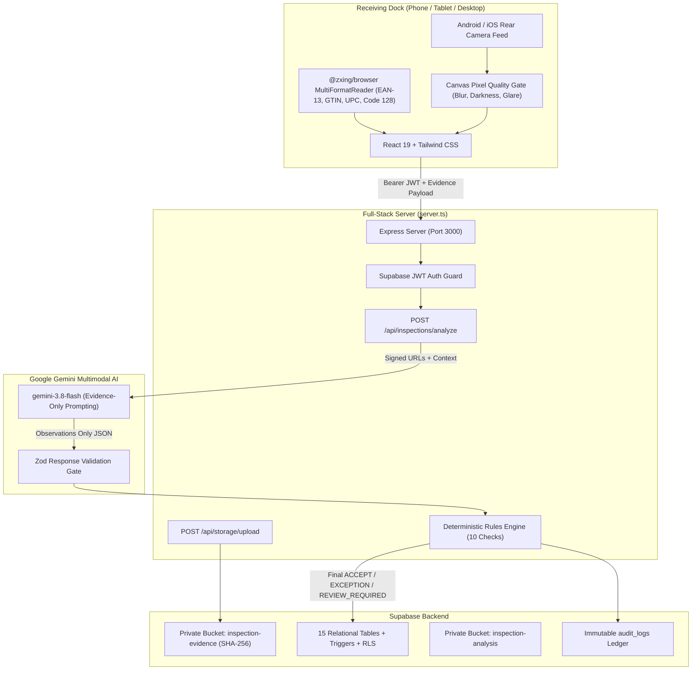

# DockProof AI — Smart Receiving Verification Platform

> **“Scan. Verify. Prove.”**

DockProof AI is a real-time, production-oriented, mobile-first logistics application designed for warehouse receiving docks. It bridges mobile camera scanning, ZXing barcode decoding, Google Gemini 3.8 Flash multimodal vision, and a deterministic pure-TypeScript rules engine atop a Supabase PostgreSQL backend.

---

## 1. Architecture Diagram



---

## 2. Zero Dummy Data Policy & Onboarding

DockProof AI enforces a strict **Zero Dummy Data Policy**:
- **No hardcoded bottles, cartons, or mock products.**
- **No simulated Gemini decisions or mock PASS/FAIL stamps.**
- The application starts with an **empty database state** and guides users through onboarding:
  1. **Add/Import Suppliers**: Direct form or CSV.
  2. **Add/Import Product Catalogue**: Form or CSV template (`dockproof_products_template.csv`).
  3. **Create/Import Inbound Purchase Orders**: Form or CSV template (`dockproof_purchase_orders_template.csv`).
  4. **Start Inspection**: The inspection wizard remains strictly locked until valid PO and product catalogue records exist.

---

## 3. Strict Safety Directives

| Safety Rule | Core Behavior |
|---|---|
| **UNCERTAIN is valid** | If photographic evidence is blurred, dark, cropped, or obstructed, the check evaluates to `UNCERTAIN` and produces `REVIEW_REQUIRED`. It **never** defaults to `ACCEPT`. |
| **Never invent evidence** | Rules engine requires verified barcode match, printed label text, or visible physical carton counts. |
| **Never estimate hidden units** | Units inside sealed cartons are marked `UNCERTAIN` unless an open carton photo or explicit carton label unit count is verified. |
| **Never identify SKU from appearance alone** | SKU identity cannot be claimed purely from bottle silhouette or product color without barcode GTIN match or legible printed label text. |
| **Shadows ≠ Water Damage** | Cardboard shadows and standard brown corrugation gradients are classified as `UNCERTAIN` (requiring manual touch check), never false positive `FAIL`. |
| **Missing components** | Only flagged if contents are clearly visible in open carton or product close-up photos. |
| **Gemini never makes final decisions** | AI generates structured factual observations; only the deterministic rules engine computes final decisions. |

---

## 4. Supabase Setup & SQL Migrations

### Project Reference
Your connected Supabase Project:
- **URL**: `https://aaqjekyrgboqhrlgcgqg.supabase.co`
- **Reference ID**: `aaqjekyrgboqhrlgcgqg`

### Applying Migrations via Supabase SQL Editor
1. Open the [Supabase SQL Editor](https://supabase.com/dashboard/project/aaqjekyrgboqhrlgcgqg/sql/new).
2. Open `supabase/all_migrations_bundle.sql`.
3. Copy and paste the contents into the editor and click **Run**.
4. This creates all 15 relational tables, triggers, indexes, and Row Level Security policies.

### Database Tables (15 Relational Tables):
- `profiles`: Roles (`RECEIVING_OPERATOR`, `RECEIVING_MANAGER`).
- `suppliers`: Vendor codes, contacts, and preferred claim processes.
- `products`: SKU, GTIN, variant, colour, units/carton, required components.
- `purchase_orders`: Inbound POs (`DRAFT`, `OPEN`, `PARTIALLY_RECEIVED`, `COMPLETED`, `EXCEPTION`).
- `purchase_order_lines`: Expected vs received carton and unit quantities.
- `inspections`: In-progress and completed receiving sessions.
- `barcode_scans`: Scanned barcode values, ZXing symbologies, and match verdicts.
- `inspection_photos`: Evidence photo records with SHA-256 hash, photo type, and storage paths.
- `inspection_checks`: Outputs of the deterministic verification rules engine.
- `ai_observations`: Raw structured observations from Gemini vision.
- `exceptions`: Discrepancy logs with severity (`LOW`, `MEDIUM`, `HIGH`) and triage status.
- `inspection_reviews`: Manager approvals, exception overrides, and re-inspection requests.
- `audit_logs`: Append-only immutable ledger.
- `application_settings`: System operating mode (`PILOT` vs `PRODUCTION`) and thresholds.
- `idempotency_keys`: Caches Edge Function / API responses to prevent duplicate execution.

---

## 5. Storage Buckets & Policies

Three private storage buckets are provisioned:
1. `inspection-evidence`: Original immutable shipment photos (Max 50MB, Operators upload, delete blocked).
2. `inspection-analysis`: Compressed copies and AI annotated crops (Max 20MB).
3. `product-reference-images`: Catalogue reference photos (Max 10MB).

---

## 6. Environment Variables

Create `.env` using `.env.example`:

```bash
# GEMINI_API_KEY: Required for Gemini AI vision API calls.
GEMINI_API_KEY="your-gemini-api-key"

# APP_URL: Host address for the application.
APP_URL="https://ais-dev-hvzw44dtgscoygdmu22z54-96121692054.asia-east1.run.app"

# SUPABASE CONFIGURATION
SUPABASE_URL="https://aaqjekyrgboqhrlgcgqg.supabase.co"
SUPABASE_ANON_KEY="eyJhbGciOiJIUzI1NiIsInR5cCI6IkpXVCJ9..."
SUPABASE_SERVICE_ROLE_KEY="eyJhbGciOiJIUzI1NiIsInR5cCI6IkpXVCJ9..."

# DOCKPROOF AI OPERATING SETTINGS
DOCKPROOF_MODE="PILOT"
```

---

## 7. Local Development & Testing

```bash
# 1. Install dependencies
npm install

# 2. Run TypeScript checks
npm run lint

# 3. Run automated unit & safety tests (41 assertions)
npm test

# 4. Start full-stack development server (Express + Vite on port 3000)
npm run dev
```

---

## 8. Real Barcode & Camera Testing Procedure

### Barcode Testing
1. Click **Start Inspection**.
2. Select your PO and SKU.
3. Tap **Open Camera Barcode Scanner**.
4. Point your rear phone camera at an actual product barcode (EAN-13, UPC-A, Code 128, QR Code).
5. The ZXing engine decodes the barcode, beeps on success, maps to the catalogue, and renders:
   - **PASS**: Barcode maps to expected SKU.
   - **FAIL**: Barcode maps to a different catalogue SKU.
   - **UNCERTAIN**: Barcode is unregistered or unreadable.
   - (Manual entry is available as fallback).

### Real Camera Photo Capture & Quality Gate
1. Tap **Launch Guided Camera Capture**.
2. Capture the 6 mandatory perspectives:
   - `BARCODE_LABEL`: Move close until barcode numbers and SKU text are clearly readable.
   - `CARTON_FRONT`: Full front face including all 4 corners.
   - `CARTON_LEFT`: Complete left side.
   - `CARTON_RIGHT`: Complete right side.
   - `CARTON_TOP`: Top surface and sealing tape.
   - `SHIPMENT_OVERVIEW`: Wide view containing all received cartons.
3. The in-browser canvas **Quality Gate** inspects each photo in real time for:
   - Blur (Laplacian variance edge analysis)
   - Darkness (luminance < 35)
   - Overexposure (luminance > 230)
   - Glare (> 12% blown-out highlights on shipping label)
4. Displays guidance: *"Barcode has glare. Tilt the carton slightly and retake"*, *"This photo is too dark"*, etc.
5. Computes SHA-256 cryptographic hash on client before uploading.

---

## 9. Pilot vs Production Workflow

### PILOT Mode (Default):
- Gemini analyzes photos and outputs structured observations.
- Rules engine evaluates all 10 checks.
- **Manager approval is strictly mandatory before any inventory acceptance.**
- No shipment is automatically released into stock.

### PRODUCTION Mode:
- Manager-only activation after passing the Launch Readiness checklist.
- Auto-accepts shipments **only** when every essential check is `PASS` with high confidence.
- Any `UNCERTAIN` check automatically routes to `REVIEW_REQUIRED`.
- Any `FAIL` check immediately routes to `EXCEPTION` and triggers quarantine.
